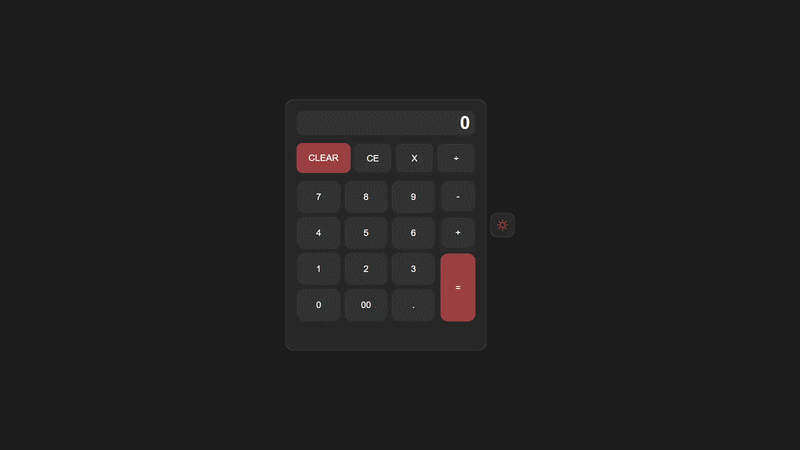

# 🧮 Calculadora

> Este é o meu primeiro projeto utilizando JavaScript, desenvolvido com o objetivo de colocar em prática os conceitos fundamentais da linguagem e aprofundar meu entendimento sobre lógica de programação.

>Este projeto representa um passo importante na minha jornada como desenvolvedor, marcando a transição da teoria para a prática. Ao longo do desenvolvimento, busquei escrever um código organizado, compreensível e escalável, sempre focando em aprender da forma mais correta possível.

> Sinta-se à vontade para explorar o projeto, testar as funcionalidades e acompanhar minha evolução como desenvolvedor 🚀

---

## 🚀 Tecnologias utilizadas

* HTML5
* CSS3
* JavaScript

---

## 🎯 Funcionalidades

* [ ] Operações básicas (+, -, *, /)
* [ ] Sistema de cálculo em tempo real
* [ ] Botão **C** (reset completo)
* [ ] Botão **CE** (limpar entrada)
* [ ] Suporte a múltiplas operações consecutivas
* [ ] Formatação de números (ex: 1.000)
* [ ] Efeitos visuais (hover, click)
* [ ] Sons de clique

---

## ▶️ Como executar

```bash
# Clone o repositório
git clone https://github.com/ryanconceicao45-boop/calculadora

# Abra o index.html no navegador
```

---

## 📸 Preview



---

## 🔥 Melhorias futuras

* [ ] Suporte a teclado
* [ ] Histórico de cálculos
* [ ] Melhor responsividade
* [ ] Animações mais avançadas

---

## 👨‍💻 Autor

**RYAN DA CONCEIÇÃO BARBOSA**

* LinkedIn: https://www.linkedin.com/in/ryan-concei%C3%A7%C3%A3o-132404283/

---

## 📄 Licença
Este projeto está sob a licença MIT.
